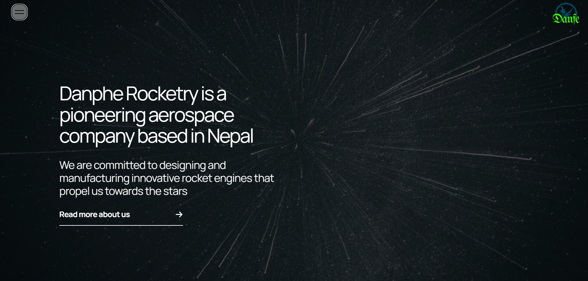

# Danphe Rocketry

🚀 **Danphe Rocketry** is a startup dedicated to advancing research in the field of rocketry. This website is built using **React + Vite** and styled with **Tailwind CSS** to provide a modern and responsive experience.

## 🌍 Live Preview



## 🛠 Tech Stack

- **React**
- **Vite**
- **Tailwind CSS**

## 📂 Project Setup

1. Clone the repository:
   ```bash
   git clone https://github.com/himanshii7/Danphe-Rocketry.git
   cd danphe-rocketry
   ```
2. Install dependencies:
   ```bash
   npm install
   ```
3. Start the development server:
   ```bash
   npm run dev
   ```

## 📦 Build for Production

To create a production build, run:
```bash
npm run build
```

## 🌟 Features
- Responsive and modern design
- Optimized with Vite for fast performance
- Styled using Tailwind CSS

## 📜 License
This project is licensed under the MIT License.

---
Developed for **Danphe Rocketry** 🚀

